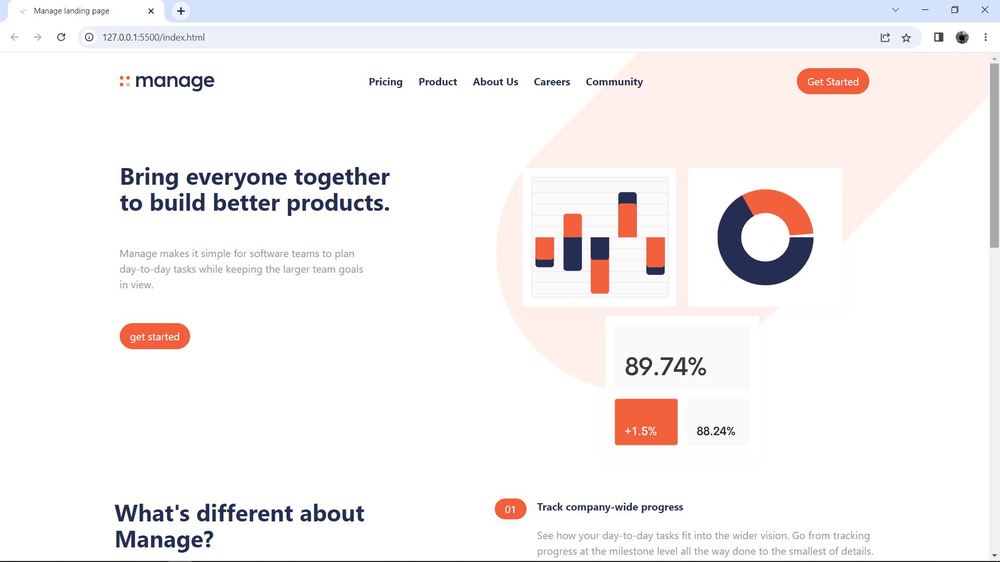

# Frontend Mentor - Manage landing page solution

This is a solution to the [Manage landing page challenge on Frontend Mentor](https://www.frontendmentor.io/challenges/manage-landing-page-SLXqC6P5).

## Overview

### Screenshot

### Links

- Live Site URL: https://mohammad-shaar.github.io/webpage-using-tailwindcss/

## My process

### Built with

- Semantic HTML5 markup
- Tailwindcss
- Flexbox
- Mobile-first workflow

### What I learned

- In this project I learnd how to build a webpage using css framwork "Tailwind"
- I lernd how to use a JavaScript library to make the slide card
- And i learnd How to work with SVG imges

### Useful resources

- [swiperjs](https://swiperjs.com/) - This helped me for build the slide card. It's a realy useful JS library.
- [svgsprit](https://svgsprit.es/) - this webpage helped me to take control over the SVG imges like change the color when hover over the imges.
